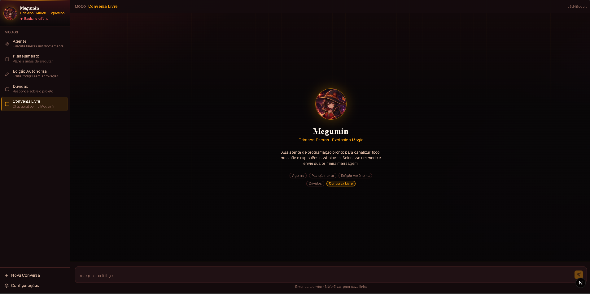
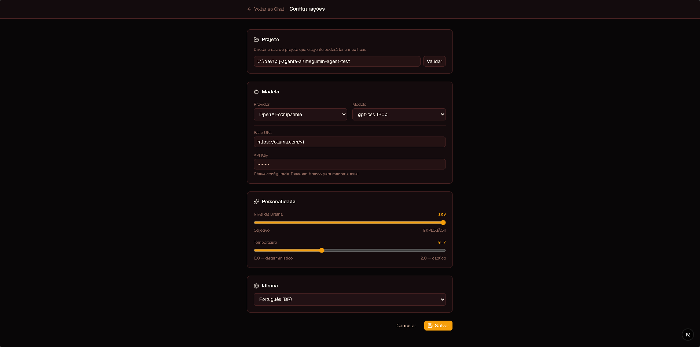

# Megumin Agent


> Assistente de programação com personalidade inspirada na Megumin de *KonoSuba*: dramática quando você quiser, profissional quando precisar.

Megumin Agent é um agente de IA para programação com backend FastAPI, orquestração LangGraph, tool calling, streaming via SSE e frontend Next.js. Ele pode conversar livremente, responder dúvidas sobre um projeto, planejar alterações e, nos modos com permissão, ler, listar e escrever arquivos dentro de um diretório autorizado.

> Para uma visão da arquitetura interna, veja [`ARCHITECTURE.md`](ARCHITECTURE.md).





---

## Funcionalidades

- **5 modos operacionais**: Agente, Planejamento, Edição Autônoma, Dúvidas e Conversa Livre.
- **Streaming SSE**: respostas aparecem em tempo real no chat.
- **Tool calling com contrato tipado**: tools retornam `ToolResult(status, content)`.
- **Eventos de agente tipados**: `TextChunkEvent` e `ToolResultEvent` no caminho grafo → SSE.
- **Sandbox de arquivos**: toda tool valida que o caminho fica dentro do `project_path`.
- **Providers configuráveis**: Ollama local ou qualquer endpoint OpenAI-compatible.
- **Personalidade ajustável**: `drama_level`, `temperature` e idioma via Settings.
- **Tema Megumin**: interface escura em carmesim/âmbar, avatar gerado por IA e foco visual no chat.

---

## Stack

| Camada | Tecnologias |
|---|---|
| Backend | Python 3.14, FastAPI, Pydantic v2, LangGraph, LangChain |
| LLM local | Ollama + `langchain-ollama` |
| LLM externo | APIs OpenAI-compatible + `langchain-openai` |
| Frontend | Next.js 16, React 19, TypeScript, Tailwind CSS v4 |
| UI | shadcn/ui, lucide-react, react-markdown |
| Package managers | `uv` no backend, `npm` no frontend |

---

## Pré-requisitos

| Requisito | Observação |
|---|---|
| Python | O projeto usa `.python-version` com `3.14` |
| uv | Gerencia dependências e execução do backend |
| Node.js | Necessário para Next.js 16 |
| npm | Instala e executa o frontend |
| Ollama | Necessário apenas se usar provider `ollama` local |

Para uso local com Ollama:

```bash
ollama pull qwen3.5:9b
```

Para provider externo, configure `openai_compatible` na tela de Settings ou via `PUT /config`.

---

## Como Instalar e Rodar

### 1. Backend

```bash
cd backend
uv sync --dev
uv run uvicorn app.main:app --reload --port 8000
```

- API: `http://localhost:8000`
- Swagger: `http://localhost:8000/docs`

Opcionalmente, copie o exemplo de env:

```bash
cp .env.example .env
```

### 2. Frontend

```bash
cd frontend
npm install
npm run dev
```

- App: `http://localhost:3000`

---

## Configuração

As configurações ficam em `backend/app/data/config.json`, que é gitignored para evitar versionar API keys.

Você pode configurar pela interface em `/settings` ou diretamente pela API:

```bash
curl -X PUT http://localhost:8000/config \
  -H "Content-Type: application/json" \
  -d '{
    "project_path": "C:/caminho/do/projeto",
    "provider": "ollama",
    "api_base_url": "http://localhost:11434",
    "model_name": "qwen3.5:9b",
    "personality": {
      "drama_level": 75,
      "temperature": 0.7,
      "language": "pt-BR"
    }
  }'
```

### Provider OpenAI-Compatible

```bash
curl -X PUT http://localhost:8000/config \
  -H "Content-Type: application/json" \
  -d '{
    "provider": "openai_compatible",
    "api_base_url": "https://ollama.com/v1",
    "api_key": "sua-chave",
    "model_name": "gpt-oss:120b"
  }'
```

O `GET /config` nunca devolve a API key real. Quando uma chave já existe, ele retorna o sentinel `"***"`, que pode ser reenviado para manter a chave salva.

---

## Modos

| Modo | Arquivos | Descrição |
|---|:---:|---|
| **Agente** | Leitura + escrita | Executa tarefas de programação com tools. |
| **Planejamento** | Leitura | Lê o projeto e propõe planos sem alterar arquivos. |
| **Edição Autônoma** | Leitura + escrita | Edição dirigida com maior autonomia de execução. |
| **Dúvidas** | Leitura | Responde perguntas sobre o projeto configurado. |
| **Conversa Livre** | Não usa projeto | Chat geral sem necessidade de `project_path`. |

Modos com acesso a arquivos exigem `project_path` configurado.

### Atalhos

| Atalho | Ação |
|---|---|
| `Ctrl+K` | Nova conversa |
| `Ctrl+1` | Agente |
| `Ctrl+2` | Planejamento |
| `Ctrl+3` | Edição Autônoma |
| `Ctrl+4` | Dúvidas |
| `Ctrl+5` | Conversa Livre |

---

## Tools do Agente

| Tool | Função |
|---|---|
| `read_file(path)` | Lê arquivo dentro do `project_path`. |
| `list_directory(path)` | Lista diretório dentro do `project_path`. |
| `write_file(path, content)` | Cria ou sobrescreve arquivo dentro do `project_path`. |

Todas validam sandbox de path. Falhas de acesso, arquivo inexistente e erros de I/O retornam `ToolResult(status="error", content=...)`, sem derrubar o grafo.

---

## API

| Método | Endpoint | Descrição |
|---|---|---|
| `GET` | `/health` | Status da API e disponibilidade do Ollama local |
| `POST` | `/chat/new` | Cria nova sessão |
| `POST` | `/chat` | Envia mensagem e retorna resposta completa |
| `POST` | `/chat/stream` | Envia mensagem com streaming SSE |
| `GET` | `/chat/{session_id}/history` | Retorna histórico da sessão |
| `GET` | `/config` | Retorna configuração com API key mascarada |
| `PUT` | `/config` | Atualiza configuração |
| `POST` | `/config/validate-path` | Valida diretório do projeto |
| `GET` | `/config/restart-required` | Indica mudanças que afetam novas conversas |
| `GET` | `/models` | Lista modelos do provider salvo |
| `POST` | `/models` | Lista modelos usando valores atuais do formulário |

---

## Estrutura

```text
megumin-agent/
├── assets/                         # Imagens usadas no README
├── backend/
│   ├── pyproject.toml
│   └── app/
│       ├── main.py                 # FastAPI bootstrap
│       ├── core/                   # Settings, exceptions, sandbox
│       ├── modules/
│       │   ├── agent/              # LangGraph, modos, providers, tools
│       │   ├── chat/               # Sessões e streaming
│       │   └── config/             # Config persistida e modelos
│       └── shared/                 # Logger e utilitários neutros
└── frontend/
    ├── public/assets/              # Avatar da Megumin usado na UI
    └── src/
        ├── app/                    # Rotas Next.js
        ├── components/             # Layout e UI base
        └── features/
            ├── chat/
            ├── config/
            └── modes/
```

---

## Verificação

Backend:

```bash
cd backend
uv run pytest
```

Frontend:

```bash
cd frontend
npx tsc --noEmit
npm run build
npm run lint
```

---

## Modelos Testados

| Modelo | Provider | Tools | Personalidade |
|---|---|:---:|---|
| `qwen3.5:9b` | Ollama local | Sim | Parcial |
| `llama3.1:8b` | Ollama local | Sim | Fraca |
| `gemma4:e4b` | Ollama local | Sim | Fraca |
| `gpt-oss:120b` | OpenAI-compatible / Ollama Cloud | Sim | Melhor |

Modelos pequenos tendem a seguir as tools, mas ignorar parte da persona. Para mais fidelidade de personalidade, prefira modelos maiores ou providers externos.

---

## Como Contribuir

1. Faça um fork do repositório
2. Crie uma branch para sua feature: `git checkout -b feat/minha-feature`
3. Faça commit das suas alterações: `git commit -m 'feat: minha feature'`
4. Envie para o seu fork: `git push origin feat/minha-feature`
5. Abra um Pull Request

---

## Créditos e Avisos

- **Personalidade inspirada** na personagem **Megumin**, da série *KonoSuba* (obra de Natsume Akatsuki). Este é um **projeto de fã**, **sem fins comerciais** e **sem afiliação oficial** com os detentores dos direitos da obra. Nenhum material protegido é redistribuído — o agente apenas se inspira no estilo da personagem via prompt.
- **Avatar e identidade visual gerados por IA** (`frontend/public/assets/megumin-profile.png`). As capturas de tela (`assets/menu.png`, `assets/settings.png`) são da própria interface do projeto.

---

## Licença

Distribuído sob licença MIT. Veja [`LICENSE`](LICENSE).

---
Desenvolvido por [Allan Giaretta](https://github.com/AllanGiaretta26)
